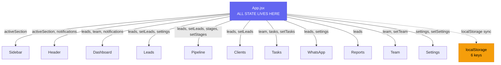

# CRM Transformer — Complete Project Analysis

> **Purpose:** Full deep-dive analysis of the `crm-transformer` project so we can plan the Supabase migration and design overhaul. Nothing is assumed; everything documented here comes from reading every single file.

---

## 1. Project Identity

| Property | Value |
|----------|-------|
| **Location** | `e:\InterShip_projects\landing-page\crm-transformer\` |
| **Framework** | React 19 + Vite 7 |
| **Styling** | Vanilla CSS (no Tailwind) |
| **Icons** | Lucide React `^0.577.0` |
| **Charts** | Recharts `^3.8.0` (devDep, but used in Dashboard + Reports) |
| **Font** | [Plus Jakarta Sans](https://fonts.google.com/specimen/Plus+Jakarta+Sans) via Google Fonts |
| **Routing** | None — manual `activeSection` state switch in App.jsx |
| **State Management** | `useState` + prop drilling (no Context, no Redux) |
| **Persistence** | 100% localStorage |
| **Auth** | None |
| **Backend** | None |

---

## 2. File Structure

```
crm-transformer/
├── index.html                    ← Vite entry (title: "vite-temp" ⚠️)
├── package.json                  ← Dependencies
├── vite.config.js                ← Minimal Vite config
├── src/
│   ├── main.jsx                  ← React root mount
│   ├── App.jsx                   ← ⭐ CENTRAL HUB — all state lives here
│   ├── index.css                 ← Global styles + design tokens
│   ├── assets/
│   │   └── react.svg             ← Unused Vite boilerplate
│   ├── components/
│   │   ├── Sidebar.jsx + .css    ← Navigation sidebar
│   │   └── Header.jsx + .css     ← Top header bar + notifications + profile dropdown
│   └── pages/
│       ├── Dashboard.jsx + .css  ← Overview metrics + revenue chart + activity feed
│       ├── Leads.jsx + .css      ← Lead management table + add/edit modal
│       ├── Pipeline.jsx + .css   ← Kanban drag-and-drop pipeline
│       ├── Clients.jsx + .css    ← Converted leads viewed as clients
│       ├── Tasks.jsx + .css      ← Task/follow-up manager
│       ├── WhatsApp.jsx + .css   ← WhatsApp message queue for contacted leads
│       ├── Reports.jsx + .css    ← Bar chart (by source) + Pie chart (by status)
│       ├── Team.jsx + .css       ← Team member cards + add/remove/activity
│       └── Settings.jsx + .css   ← Company branding, communication, requirements, budgets, templates
└── dist/                         ← Build output
```

---

## 3. Architecture — How Everything Connects

### 3.1 Data Flow Diagram



### 3.2 Navigation Flow (No Router)

```
App.jsx: activeSection state (string)
│
├── 'dashboard'  → <Dashboard />
├── 'leads'      → <Leads />
├── 'pipeline'   → <Pipeline />
├── 'clients'    → <Clients />
├── 'tasks'      → <Tasks />
├── 'whatsapp'   → <WhatsApp />
├── 'reports'    → <Reports />
├── 'team'       → <Team />
└── 'settings'   → <Settings />
```

The sidebar and header both receive `setActiveSection` to navigate.

---

## 4. State Architecture — The God Component Problem

> [!WARNING]
> **[App.jsx](file:///e:/InterShip_projects/landing-page/crm-transformer/src/App.jsx) is a "God Component"** — it owns ALL application state and passes everything down via props. There is no Context, no custom hooks, no state management library. Every piece of data and every setter function flows down through prop drilling.

### 4.1 All State Variables (defined in App.jsx)

| State Variable | Type | localStorage Key | Initial Value |
|---------------|------|-------------------|---------------|
| `activeSection` | `string` | ❌ Not persisted | `'dashboard'` |
| `sidebarCollapsed` | `boolean` | ❌ Not persisted | `false` |
| `leads` | `Lead[]` | `crm_leads` | 5 mock leads |
| `stages` | `Stage[]` | `crm_stages` | 4 default stages |
| `settings` | `Settings` | `crm_settings` | Default config object |
| `team` | `TeamMember[]` | `crm_team` | 3 mock members |
| `tasks` | `Task[]` | `crm_tasks` | 3 mock tasks |
| `notifications` | `Notification[]` | `crm_notifications` | `[]` |

### 4.2 localStorage Dependencies (6 keys)

| Key | What It Stores | Synced By |
|-----|---------------|-----------|
| `crm_leads` | All leads (array of objects) | `useEffect` on `leads` change |
| `crm_stages` | Pipeline stages | `useEffect` on `stages` change |
| `crm_settings` | Company config, budgets, requirements, templates | `useEffect` on `settings` change |
| `crm_team` | Team members | `useEffect` on `team` change |
| `crm_tasks` | All tasks | `useEffect` on `tasks` change |
| `crm_notifications` | Notification history (max 50) | `useEffect` on `notifications` change |

> [!CAUTION]
> **Every single piece of data is localStorage-only.** No backend. No authentication. No multi-user support. No data backup. If the user clears browser data, everything is gone.

---

## 5. Data Models (Inferred from Code)

### 5.1 Lead

```typescript
interface Lead {
  id: number;              // Date.now() or sequential
  name: string;            // Lead/contact name
  company: string;         // Company name
  phone: string;           // Phone number
  email: string;           // Email address
  contact: string;         // Derived: email || phone
  source: string;          // 'GBP' | 'Website' | 'WhatsApp' | 'LinkedIn' | 'Referral' | 'Manual'
  status: string;          // 'Hot' | 'Warm' | 'Cold' | 'Converted' | 'Converted (Client)'
  date: string;            // ISO date string (YYYY-MM-DD)
  budget: string;          // e.g., '₹5L - ₹15L' (from settings.budgetOptions)
  req: string;             // Requirement (from settings.requirementOptions)
  dealValue: string;       // Numeric string — project/deal value
  wonAmount: string;       // Numeric string — amount collected
  stage: string;           // Pipeline stage ID: 'new' | 'contacted' | 'proposal' | 'won' | custom
  notes?: string;          // Optional notes
}
```

### 5.2 Stage

```typescript
interface Stage {
  id: string;              // Slug: 'new', 'contacted', 'proposal', 'won', or custom
  title: string;           // Display name
}
```

### 5.3 Task

```typescript
interface Task {
  id: number;              // Date.now()
  desc: string;            // Task description
  assignee: string;        // Team member name (string, not ID!)
  due: string;             // ISO date string
  status: string;          // 'Pending' | 'In Progress' | 'Completed'
  priority: string;        // 'High' | 'Medium' | 'Low'
}
```

### 5.4 Team Member

```typescript
interface TeamMember {
  id: number;              // Sequential or Date.now()
  name: string;
  role: string;            // 'Workspace Owner' | 'Manager' | 'Sales rep' | custom
  email: string;
  status: string;          // 'Active' | 'Away'
  leads: number;           // Lead count (static, never auto-updated!)
  activity: string[];      // Activity log entries (hardcoded strings)
}
```

### 5.5 Settings

```typescript
interface Settings {
  company: string;              // Company display name
  industry: string;             // 'Manufacturing' | 'Service Provider' | 'Agency' | custom
  whatsapp: string;             // WhatsApp business number
  email: string;                // Notification email
  autoAssign: string;           // Auto-assign rule (unused in UI!)
  waTemplate: string;           // WhatsApp message template with {{name}}, {{company}}, {{requirement}}
  requirementOptions: string[]; // Dynamic list of requirement types
  budgetOptions: string[];      // Dynamic list of budget ranges
  ownerName?: string;           // Owner name (shown in header)
  ownerRole?: string;           // Owner role (shown in header)
  logo?: string;                // Base64 data URL of uploaded logo
  logoUrl?: string;             // External logo URL (used in header avatar)
}
```

### 5.6 Notification

```typescript
interface Notification {
  id: number;              // Date.now() + Math.random()
  text: string;            // Notification message
  time: string;            // Formatted time string (HH:MM)
  unread: boolean;         // Read/unread flag
}
```

---

## 6. Page-by-Page Business Logic

### 6.1 Dashboard — [Dashboard.jsx](file:///e:/InterShip_projects/landing-page/crm-transformer/src/pages/Dashboard.jsx)

**Purpose:** Overview of key metrics, revenue chart, and recent activity.

**Metrics computed from leads:**
- **Total Leads** — `leads.length`
- **Converted** — leads with status `'Converted'` or `'Converted (Client)'`
- **In Pipeline** — leads NOT Converted and NOT Lost
- **Total Revenue** — `sum(dealValue)` across all leads

**Revenue Chart (Recharts AreaChart):**
- 3 periods: This Month, Last Month, This Year
- `buildMonthlyChart()` — groups leads by day within a month → weekly buckets (Wk 1–4)
- `buildYearlyChart()` — groups by month (Jan–Dec)
- Revenue = `dealValue` (not `wonAmount`!)

**Recent Activity:**
- Pulls from `notifications` array (last 8)
- Color-codes by emoji/keyword: ✅=success, ✏️=primary, 🗑️=warning

> [!NOTE]
> **Trend percentages are hardcoded** (`+12%`, `+5%`, `-2%`, `+18%`) — they don't reflect real data changes.

---

### 6.2 Leads — [Leads.jsx](file:///e:/InterShip_projects/landing-page/crm-transformer/src/pages/Leads.jsx)

**Purpose:** Full lead management with CRUD operations.

**Features:**
- Search by name or contact info
- Filter by status (All/Hot/Warm/Cold/Converted)
- Add new lead via modal form
- Edit existing lead via same modal
- Delete lead with confirmation
- Per-row dropdown menu (Edit Details, View Pipeline, Delete)

**Form fields:** Name*, Company*, Phone*, Email, Source*, Status, Requirement, Budget*, Deal Value*, Won Amount, Notes

**Business Logic:**
- `contact` is derived as `email || phone` on save
- New leads get `id: Date.now()` and `date: today`
- Requirement and Budget dropdowns are populated from `settings.requirementOptions` and `settings.budgetOptions`
- Notifications fired on add (`➕`), update (`✏️`), delete (`🗑️`)

---

### 6.3 Pipeline — [Pipeline.jsx](file:///e:/InterShip_projects/landing-page/crm-transformer/src/pages/Pipeline.jsx)

**Purpose:** Kanban-style drag-and-drop sales pipeline.

**Default Stages:** New Leads → Contacted → Proposal Sent → Closed Won

**Features:**
- HTML5 drag-and-drop (native, not a library)
- Dragging a lead to "won" column auto-sets `status: 'Converted'`
- Add new stages dynamically via `prompt()`
- Add leads directly from pipeline (also via `prompt()`)
- Stage card count shown in header

> [!WARNING]
> **UX problem:** Adding cards and stages uses `window.prompt()` — very basic, no form validation.

---

### 6.4 Clients — [Clients.jsx](file:///e:/InterShip_projects/landing-page/crm-transformer/src/pages/Clients.jsx)

**Purpose:** View converted leads as "clients."

**Logic:**
- Filters `leads` where `status.toLowerCase() === 'converted'`
- Not a separate data entity — clients ARE leads with Converted status
- "View Details" uses `window.alert()` — extremely basic
- "Export PDF" just calls `window.print()`

> [!NOTE]
> Clients is a **derived view**, not a separate entity. There's no client-specific data beyond what's in the lead record.

---

### 6.5 Tasks — [Tasks.jsx](file:///e:/InterShip_projects/landing-page/crm-transformer/src/pages/Tasks.jsx)

**Purpose:** Task and follow-up management.

**Features:**
- Add tasks via modal (description, assignee, due date, priority, status)
- Toggle task completion (Done/Undo)
- Assignee dropdown populated from `team` member names
- Priority badges: High (red), Medium (yellow), Low (green)

> [!NOTE]
> Tasks are **NOT linked to leads** — there's no `leadId` field. A task is a free-floating item.

---

### 6.6 WhatsApp — [WhatsApp.jsx](file:///e:/InterShip_projects/landing-page/crm-transformer/src/pages/WhatsApp.jsx)

**Purpose:** Send WhatsApp messages to leads in "contacted" stage.

**Logic:**
- Filters leads where `stage === 'contacted'`
- Template variables: `{{name}}`, `{{company}}`, `{{requirement}}`
- Sends via `https://wa.me/{phone}?text={encoded_message}` — opens in new tab
- Tracks sent IDs in local state (not persisted — resets on page revisit!)

---

### 6.7 Reports — [Reports.jsx](file:///e:/InterShip_projects/landing-page/crm-transformer/src/pages/Reports.jsx)

**Purpose:** Visual analytics.

**Charts:**
1. **Leads by Source** (Bar Chart) — counts leads per source
2. **Leads by Status** (Donut/Pie Chart) — Hot/Warm/Cold/Converted breakdown

> [!NOTE]
> Reports are **read-only views** derived from leads. No date filtering, no export, no custom report builder.

---

### 6.8 Team — [Team.jsx](file:///e:/InterShip_projects/landing-page/crm-transformer/src/pages/Team.jsx)

**Purpose:** Team member management.

**Features:**
- Card-based member display (avatar, role, email, lead count, status)
- Add member modal (name, email, role with "Other" option, status)
- View member activity log (modal)
- Remove member with confirmation modal
- Role options: Sales rep, Manager, Admin, Other (custom)

> [!WARNING]
> The `leads` count on team members is **static** — it's set when the mock data is created and never auto-updated based on actual lead assignments. There's no lead-to-team-member assignment system.

---

### 6.9 Settings — [Settings.jsx](file:///e:/InterShip_projects/landing-page/crm-transformer/src/pages/Settings.jsx)

**Purpose:** System configuration.

**Sections:**
1. **Company Branding** — name, owner name, owner role, logo upload (base64), industry type
2. **Communication** — WhatsApp number, notification email
3. **Lead Requirements** — dynamic tag list (add/remove requirement types)
4. **Budget Ranges** — dynamic tag list (add/remove budget ranges)
5. **Message Templates** — WhatsApp template with `{{name}}`, `{{company}}`, `{{requirement}}` variables

> [!NOTE]
> The "Save Changes" button shows a success toast but **doesn't actually do a separate save** — settings are already auto-saved to localStorage via useEffect. The button is cosmetic.

---

## 7. Layout Components

### 7.1 Sidebar — [Sidebar.jsx](file:///e:/InterShip_projects/landing-page/crm-transformer/src/components/Sidebar.jsx)

- Dark theme (`var(--dark)` = `#0f172a`)
- Collapsible (toggle button, labels hide)
- 9 nav items with Lucide icons
- Shows company logo from settings (or ⚡ emoji)
- Active item has gradient purple background with glow shadow
- Responsive: collapses at 1024px, goes horizontal at 768px

### 7.2 Header — [Header.jsx](file:///e:/InterShip_projects/landing-page/crm-transformer/src/components/Header.jsx)

- Glass morphism background with blur
- Dynamic title based on `activeSection`
- Global search bar (UI only — **search doesn't work!**)
- Notification bell with unread badge + dropdown list
- Profile menu with owner info, email, phone, company + link to Settings

> [!WARNING]
> The **header search bar is non-functional** — it renders an input but has no `onChange` handler or search logic.

---

## 8. Design System

### 8.1 CSS Variables (from [index.css](file:///e:/InterShip_projects/landing-page/crm-transformer/src/index.css))

| Token | Value | Usage |
|-------|-------|-------|
| `--primary` | `#6366f1` (Indigo) | Active states, CTAs, accents |
| `--primary-light` | `#818cf8` | Gradients, lighter accents |
| `--primary-dark` | `#4f46e5` | Hover states |
| `--success` | `#10b981` (Emerald) | Converted status, positive trends |
| `--warning` | `#f59e0b` (Amber) | Pipeline/warning states |
| `--danger` | `#ef4444` (Red) | Delete actions, negative |
| `--dark` | `#0f172a` (Slate 900) | Sidebar, headings |
| `--slate-800` | `#1e293b` | Body text |
| `--gray` | `#94a3b8` | Muted text, icons |
| `--border` | `#e2e8f0` | All borders |
| `--glass` | `rgba(255,255,255,0.7)` | Glassmorphism panels |
| `--shadow-lg` | Complex multi-layer | Modals, cards |

### 8.2 Visual Patterns

| Pattern | Implementation |
|---------|---------------|
| Cards | `.glass-panel` with backdrop-filter blur |
| Modals | Fixed backdrop + centered content + slide-up animation |
| Tables | Full-width with hover rows |
| Buttons | `.btn .btn-primary` (indigo gradient) |
| Status badges | Colored pills: hot (red-ish), warm (amber), cold (blue), converted (green) |
| Animations | `fadeIn` keyframe on page transitions |
| Font | Plus Jakarta Sans (400–800 weights) |
| Scrollbar | Custom thin 8px with slate colors |

### 8.3 Responsiveness

- `768px` breakpoint: sidebar goes horizontal, content padding reduces
- `640px` breakpoint: modal form rows stack vertically
- `1024px` breakpoint: sidebar auto-collapses to icon-only

---

## 9. Critical Problems & Technical Debt

| # | Problem | Severity | Detail |
|---|---------|----------|--------|
| 1 | **All data in localStorage** | 🔴 Critical | No backup, no sync, no multi-device, 5MB limit |
| 2 | **No authentication** | 🔴 Critical | Anyone with the URL can access/modify all data |
| 3 | **God component anti-pattern** | 🟡 Major | App.jsx owns 8+ state variables, 6+ useEffects, all prop drilling |
| 4 | **No data relationships** | 🟡 Major | Tasks not linked to leads; team member lead counts are static |
| 5 | **Hardcoded trend percentages** | 🟡 Major | Dashboard metrics show fake `+12%`, `+5%` trends |
| 6 | **Non-functional header search** | 🟡 Major | Search bar renders but doesn't do anything |
| 7 | **`window.prompt()` / `window.alert()` usage** | 🟡 Major | Pipeline add and Client details use browser primitives |
| 8 | **WhatsApp sent tracking not persisted** | 🟠 Medium | Resets on component unmount |
| 9 | **No date/time on leads** | 🟠 Medium | Only date, no timestamp — can't sort by creation time |
| 10 | **Logo stored as base64 in localStorage** | 🟠 Medium | Can eat into 5MB limit fast |
| 11 | **No pagination** | 🟠 Medium | All leads rendered at once — will lag with 1000+ |
| 12 | **`recharts` in devDependencies** | 🟡 Minor | Should be in dependencies (works because Vite bundles it anyway) |
| 13 | **Page title is "vite-temp"** | 🟡 Minor | index.html never updated from boilerplate |

---

## 10. Existing Supabase Infrastructure

Your existing project (`white-label-business-manger0`) already has Supabase set up with:

**Supabase Instance:** `https://agedvffyanqguwlgtugr.supabase.co`

**Existing Tables:**
| Table | Purpose | Key Columns |
|-------|---------|-------------|
| `user_data` | Main user store blob | `user_id`, `store_data` (JSONB) |
| `inventory_management` | Product inventory | `user_id`, `product_id`, `sku`, `name`, `category`, prices, stock |

**Auth:** Clerk (separate from Supabase Auth) — user ID passed via `x-client-user-id` header.

---

## 11. Proposed Supabase Migration — New Tables for CRM

> [!IMPORTANT]
> These are the tables we'll need to create in the **same Supabase project** to migrate CRM Transformer off localStorage.

### 11.1 `crm_leads`

```sql
CREATE TABLE crm_leads (
  id            BIGSERIAL PRIMARY KEY,
  user_id       TEXT NOT NULL,               -- Clerk user ID
  name          TEXT NOT NULL,
  company       TEXT,
  phone         TEXT,
  email         TEXT,
  source        TEXT DEFAULT 'Manual',       -- GBP, Website, WhatsApp, LinkedIn, Referral, Manual
  status        TEXT DEFAULT 'Warm',         -- Hot, Warm, Cold, Converted
  stage         TEXT DEFAULT 'new',          -- Pipeline stage ID
  budget        TEXT,
  requirement   TEXT,
  deal_value    DECIMAL(12,2) DEFAULT 0,
  won_amount    DECIMAL(12,2) DEFAULT 0,
  notes         TEXT,
  assigned_to   BIGINT REFERENCES crm_team_members(id),  -- NEW: link to team
  created_at    TIMESTAMPTZ DEFAULT NOW(),
  updated_at    TIMESTAMPTZ DEFAULT NOW()
);
```

### 11.2 `crm_pipeline_stages`

```sql
CREATE TABLE crm_pipeline_stages (
  id            BIGSERIAL PRIMARY KEY,
  user_id       TEXT NOT NULL,
  slug          TEXT NOT NULL,               -- 'new', 'contacted', 'proposal', 'won', custom
  title         TEXT NOT NULL,
  position      INT DEFAULT 0,              -- NEW: ordering
  color         TEXT,                        -- NEW: stage color
  created_at    TIMESTAMPTZ DEFAULT NOW(),
  UNIQUE(user_id, slug)
);
```

### 11.3 `crm_tasks`

```sql
CREATE TABLE crm_tasks (
  id            BIGSERIAL PRIMARY KEY,
  user_id       TEXT NOT NULL,
  description   TEXT NOT NULL,
  lead_id       BIGINT REFERENCES crm_leads(id),  -- NEW: link tasks to leads
  assigned_to   BIGINT REFERENCES crm_team_members(id),
  due_date      DATE,
  status        TEXT DEFAULT 'Pending',      -- Pending, In Progress, Completed
  priority      TEXT DEFAULT 'Medium',       -- High, Medium, Low
  created_at    TIMESTAMPTZ DEFAULT NOW(),
  updated_at    TIMESTAMPTZ DEFAULT NOW()
);
```

### 11.4 `crm_team_members`

```sql
CREATE TABLE crm_team_members (
  id            BIGSERIAL PRIMARY KEY,
  user_id       TEXT NOT NULL,               -- Workspace owner's Clerk ID
  name          TEXT NOT NULL,
  email         TEXT,
  role          TEXT DEFAULT 'Sales rep',
  status        TEXT DEFAULT 'Active',       -- Active, Away, Offline
  avatar_url    TEXT,                        -- NEW: profile picture
  created_at    TIMESTAMPTZ DEFAULT NOW()
);
```

### 11.5 `crm_activity_log`

```sql
CREATE TABLE crm_activity_log (
  id            BIGSERIAL PRIMARY KEY,
  user_id       TEXT NOT NULL,
  actor_id      BIGINT REFERENCES crm_team_members(id),  -- Who did it
  lead_id       BIGINT REFERENCES crm_leads(id),          -- Related lead (optional)
  action        TEXT NOT NULL,               -- 'lead_created', 'lead_updated', 'stage_moved', etc.
  description   TEXT NOT NULL,               -- Human-readable description
  metadata      JSONB,                       -- Additional structured data
  created_at    TIMESTAMPTZ DEFAULT NOW()
);
```

### 11.6 `crm_settings`

```sql
CREATE TABLE crm_settings (
  id            BIGSERIAL PRIMARY KEY,
  user_id       TEXT NOT NULL UNIQUE,
  company_name  TEXT,
  owner_name    TEXT,
  owner_role    TEXT,
  industry      TEXT,
  whatsapp      TEXT,
  email         TEXT,
  logo_url      TEXT,                        -- Supabase Storage URL (not base64!)
  auto_assign   TEXT,
  wa_template   TEXT,
  requirement_options JSONB DEFAULT '[]',
  budget_options      JSONB DEFAULT '[]',
  created_at    TIMESTAMPTZ DEFAULT NOW(),
  updated_at    TIMESTAMPTZ DEFAULT NOW()
);
```

### 11.7 `crm_whatsapp_log`

```sql
CREATE TABLE crm_whatsapp_log (
  id            BIGSERIAL PRIMARY KEY,
  user_id       TEXT NOT NULL,
  lead_id       BIGINT REFERENCES crm_leads(id),
  message       TEXT,
  sent_at       TIMESTAMPTZ DEFAULT NOW(),
  status        TEXT DEFAULT 'sent'          -- sent, delivered, failed
);
```

---

## 12. Key Improvements to Make Alongside Migration

### Architecture
- [ ] Replace God component with React Context (like `white-label-business-manger0/DataContext.jsx`)
- [ ] Add Clerk authentication
- [ ] Add Supabase client + auto-save with debounced sync
- [ ] Add React Router for proper URL-based navigation

### Data Relationships
- [ ] Link tasks to leads via `lead_id`
- [ ] Link leads to team members via `assigned_to`
- [ ] Auto-calculate team member lead counts
- [ ] Replace `window.prompt()` / `window.alert()` with proper modals
- [ ] Persist WhatsApp send log

### Design & UX
- [ ] Make header search functional (global search across leads, tasks, team)
- [ ] Compute real trend percentages on dashboard
- [ ] Add pagination/virtual scrolling for lead tables
- [ ] Store logo in Supabase Storage instead of base64
- [ ] Fix page title from "vite-temp"
- [ ] Add loading states, empty states, error states
- [ ] Add dark mode support

---

## 13. Relationship to Parent Project

```
landing-page/
├── temp-app/                        ← Next.js marketing site
├── white-label-business-manger0/    ← React dashboard (inventory, invoices)
│   └── Uses: Clerk auth + Supabase (user_data + inventory_management tables)
└── crm-transformer/                 ← THIS PROJECT (CRM module)
    └── Currently: No auth, no backend, localStorage only
    └── Target:    Same Clerk auth + Same Supabase project, new CRM tables
```

The CRM Transformer is meant to be the **"CRM & Lead Manager" tool** shown on the tools page of the landing site. It needs to integrate with the same auth and database infrastructure.

---

*Analysis complete. Ready for client change requests.*
